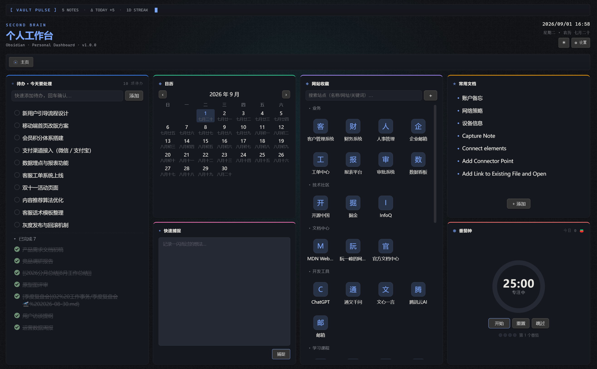
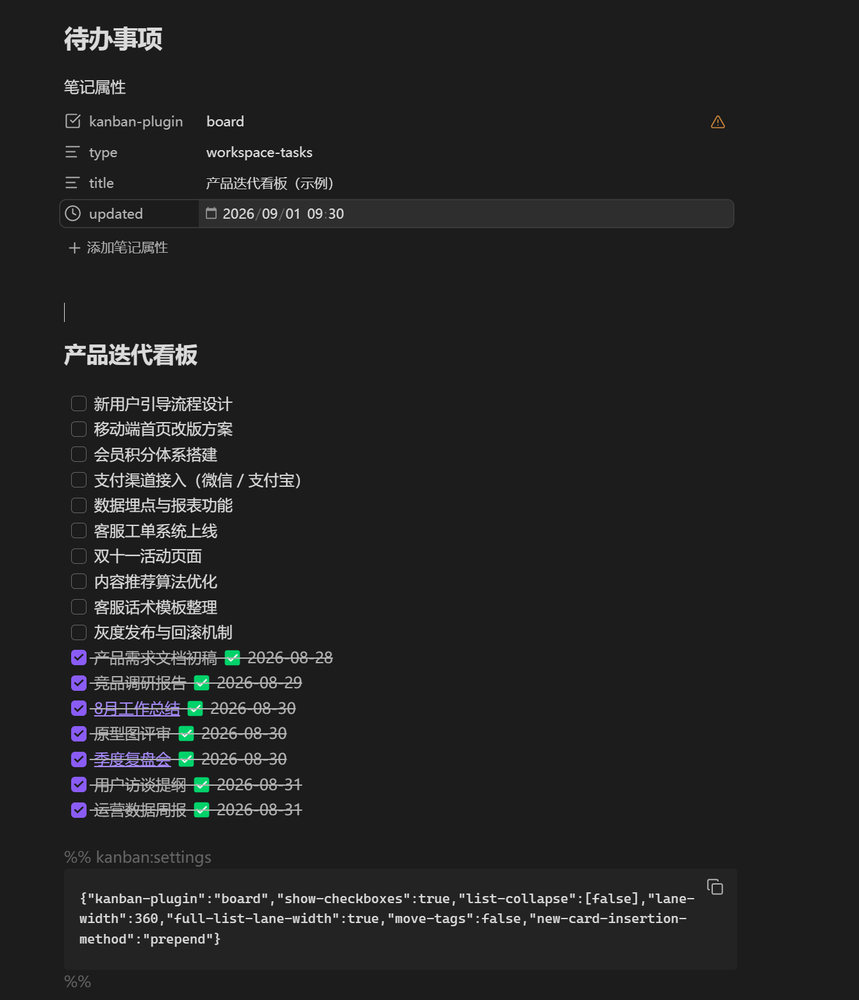
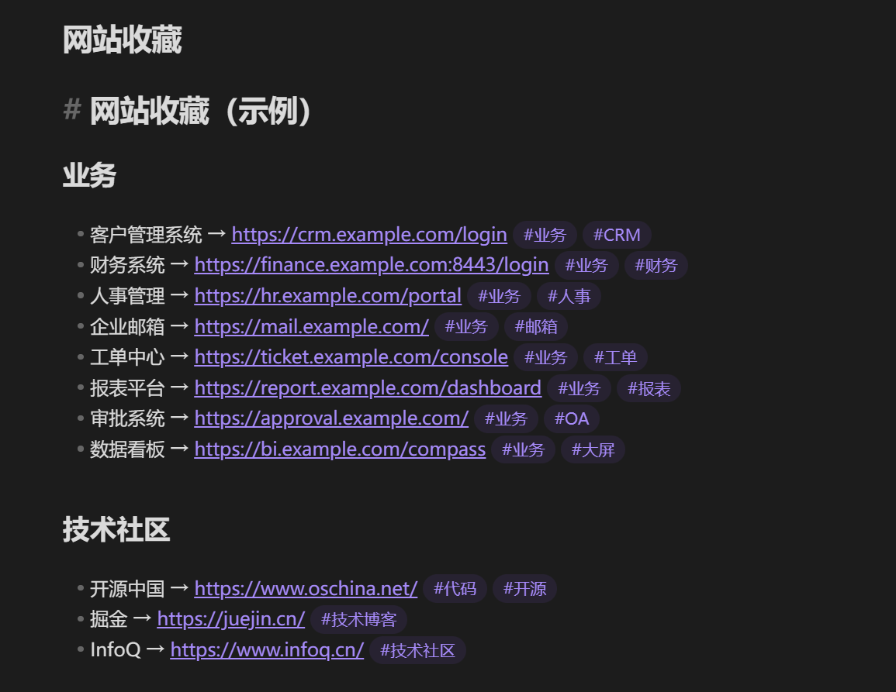

# MiniDashboard ｜ 极简个人工作台

> 把「待办 / 天气 / 日历 / 网站收藏 / 常用文档 / 灵感捕捉 / 番茄钟」收进一个页面。数据全部存在你自己的本地 Markdown 里，**离线可用、你拥有全部数据**。

[English](README.md) · 中文文档

  

---

## 亮点

- **⚡ 极简** — 只保留常用 7 张卡，去掉一切冗余。编译产物仅 **~130KB**，**零第三方运行时依赖**（无框架，UI 全部手写 DOM/SVG）。
- **🔗 Markdown 双链** — 数据不进数据库，就是 Vault 里的 `.md` 文件：网站收藏、常用文档、待办看板都与 Markdown 文档**双向同步**，卡片 ↔ 文档任意一侧改动即时生效，可直接手编文档。
- **🌐 中英双语** — 界面语言一键切换 中文 / English（设置 → 外观 → 语言）。
- **🧩 模块位置可调** — 每张卡的位置（顺序）统一在「设置 → 首页模块」用上移 / 下移调整。
- **📐 大小可调** — 每张卡的**宽（1–4 列）与高（1–4 行）**可分别设置，拼出你的专属版式。
- **🔒 本地优先** — 不依赖任何外部账号或云端，天气也仅需网络（wttr.in，免 key）。
- **📱 跨端可用** — 同时支持桌面端与 Obsidian Mobile，移动端长按条目呼出菜单。
- **🌗 深浅双主题** — 跟随 Obsidian 外观，或一键强制深 / 浅色。

---

## 功能

| 模块 | 说明 |
| --- | --- |
| **待办 · 今天要处理** | 快速添加、待办 / 已完成分组、点击勾选、**双击快速编辑**；与 **Obsidian Kanban 插件双向兼容**——直接读写你现有的 Kanban 数据文件，Kanban 插件可继续正常使用 |
| **天气** | 实时时钟 + **最多 3 个城市**实时天气（wttr.in 免 key），10 分钟缓存、可手动刷新 |
| **日历** | 月历视图（**含农历**）、今天高亮、上 / 下月切换 |
| **网站收藏** | **按分类分组**、站点图标（emoji / favicon）、关键词搜索、增删改；数据存 Markdown **双向同步** |
| **常用文档** | 把常用笔记固定到首页，点击直达；`- [[路径\|显示名]]` 存 Markdown **双向同步** |
| **灵感捕捉** | 输入即在 Vault 新建笔记，支持模板与命名规则 |
| **番茄钟** | 专注 / 短休 / 长休三阶段倒计时，环形进度 + 开始·暂停·重置·跳过，**今日番茄计数**（跨天自动归零），结束提示音（Web Audio，无需资源） |

---

## 截图

<p align="center">
  
  <br/>
  <sub>首页</sub>
</p>

---

## 安装

### 手动安装（推荐自己用）

1. 将 `dashboard` 文件夹复制到 `<你的库>/.obsidian/plugins/` 目录下；
2. 打开 Obsidian **设置 → 第三方插件**，**关闭安全模式**（关闭时若提示重启，请先重启一次）；
3. 在「已安装插件」列表中找到 **MiniDashboard**，点击**启用**；
4. **重启 Obsidian**（或在命令面板执行 **Reload app without saving** / 重新加载应用而不保存）；
5. 重启后，在**左侧边栏**找到 **Dashboard 图标按钮**，点击即可打开工作台。

仓库附带 [`sample-data/`](sample-data/) 示例数据——把里面的文件复制进你的库，各卡片即直接有内容展示。

---

## 数据格式

**所有数据都是 Vault 里的 Markdown 文件**，双向同步，可直接手编，可版本管理。

| 数据 | 默认文件 | Markdown 格式 |
| --- | --- | --- |
| 待办（Kanban 兼容） | `Dashboard/待办事项.md`（可改） | `## 列` 下 `- [ ] / - [x]` 任务行，含 `[ID::] [状态::]` 与 `✅ 完成日期` |
| 网站收藏 | `Dashboard/网站收藏.md`（可改） | `## 分类` 分组 + `- [图标] 名称 → 网址 #关键词` |
| 常用文档 | `Dashboard/常用文档.md`（可改） | `- [[库内路径\|显示名]]`（Obsidian 原生双链） |
| 灵感捕捉 | 指定文件夹（默认 `Dashboard/Temp`） | 按命名规则新建的笔记 |
| 天气 / 日历 | 插件 `data.json` | 插件配置数据（非笔记） |

底层 Markdown 文档实际长这样——随时可以直接手编：

| 待办（Kanban 文件） | 网站收藏文件 |
| :---: | :---: |
|  |  |

所有文件路径都可在 **设置 → 数据存储位置** 统一修改，改后即时生效。

---

## 自定义布局

首页卡片的 **显示 / 隐藏、位置（顺序）、大小（宽 1–4 列 / 高 1–4 行）** 全部在 **设置 → 首页模块** 中集中管理，修改即时生效；「恢复默认布局」一键还原。

---

## 目录结构

```
.
├─ main.js            # 构建产物（随插件分发）
├─ manifest.json      # 插件清单
├─ styles.css         # 全部样式（深浅主题自适应，--ad-* CSS 变量）
├─ versions.json      # 兼容版本表（社区规范）
├─ src/               # TypeScript 源码
│  ├─ main.ts             # 插件主类：视图注册、设置迁移、主题
│  ├─ settings.ts         # 设置面板 + 首页模块布局管理
│  ├─ icons.ts            # 手写 SVG 图标
│  ├─ data/               # 纯函数数据层（Kanban / 网站收藏 / 常用文档解析 + 单测）
│  └─ views/              # 视图层（DashboardView + 3 个 Modal + 移动端长按菜单）
├─ package.json / tsconfig.json / esbuild.config.mjs
└─ LICENSE
```

---

## 许可证

[ISC](LICENSE) · © 2026 xw

---

> ⚙️ 一个原则：**你的数据是你自己的**。本插件不发送任何数据到任何服务器（天气除外，仅向 wttr.in 请求天气信息）。
